---
## Front matter
title: "Отчёт по лабораторной работе № 7"
subtitle: "НКАбд-04-22"
author: "Чепелевич Владислав Олегович"

## Generic otions
lang: ru-RU
toc-title: "Содержание"

## Bibliography
bibliography: bib/cite.bib
csl: pandoc/csl/gost-r-7-0-5-2008-numeric.csl

## Pdf output format
toc: true # Table of contents
toc-depth: 2
lof: true # List of figures
fontsize: 12pt
linestretch: 1.5
papersize: a4
documentclass: scrreprt
## I18n polyglossia
polyglossia-lang:
  name: russian
  options:
	- spelling=modern
	- babelshorthands=true
polyglossia-otherlangs:
  name: english
## I18n babel
babel-lang: russian
babel-otherlangs: english
## Fonts
mainfont: PT Serif
romanfont: PT Serif
sansfont: PT Sans
monofont: PT Mono
mainfontoptions: Ligatures=TeX
romanfontoptions: Ligatures=TeX
sansfontoptions: Ligatures=TeX,Scale=MatchLowercase
monofontoptions: Scale=MatchLowercase,Scale=0.9
## Biblatex
biblatex: true
biblio-style: "gost-numeric"
biblatexoptions:
  - parentracker=true
  - backend=biber
  - hyperref=auto
  - language=auto
  - autolang=other*
  - citestyle=gost-numeric
## Pandoc-crossref LaTeX customization
figureTitle: "Рис."
tableTitle: "Таблица"
listingTitle: "Листинг"
lofTitle: "Список иллюстраций"
lolTitle: "Листинги"
## Misc options
indent: true
header-includes:
  - \usepackage{indentfirst}
  - \usepackage{float} # keep figures where there are in the text
  - \floatplacement{figure}{H} # keep figures where there are in the text
---

# Цель работы

Освоение арифметических инструкций языка ассемблера NASM.

# Задание
1. выполнить работу с символьными и численными данными в NASM
2. Отработать на практике арифметические операции в NASM
3. Написать программу вычисления выражения с входными данными

# Порядок выполнения лабораторной работы

## Символьные и численные данные в NASM

1. Создали каталог для программам лабораторной работы № 7, перешли в
него и создайте файл lab7-1.asm. (рис. [-@fig:001])

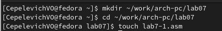{ #fig:001 width=70% }

2. Рассмотрели примеры программ вывода символьных и численных значений. Программы будут выводить значения записанные в регистр eax.
Ввели в файл lab7-1.asm текст программы из листинга 7.1. (рис. [-@fig:002]) В данной программе в регистр eax записывается символ 6 (mov eax,'6'), в регистр ebx
символ 4 (mov ebx,'4'). Далее к значению в регистре eax прибавляется значение регистра ebx (add eax,ebx, результат сложения запишется в регистр
eax). Далее выводится результат. Так как для работы функции sprintLF в регистр eax должен быть записан адрес, необходимо использовать дополнительную переменную. Для этого записали значение регистра eax в переменную buf1
(mov [buf1],eax), а затем записали адрес переменной buf1 в регистр eax (mov eax,buf1) и вызвали функцию sprintLF.

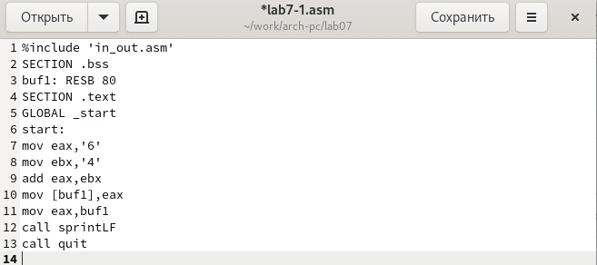{ #fig:002 width=70% }

Создали исполняемый файл и запустили его. (рис. [-@fig:003])

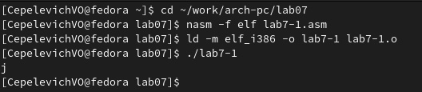{ #fig:003 width=70% }

3. Далее изменили текст программы и вместо символов, записали в регистры числа. (рис. [-@fig:004])

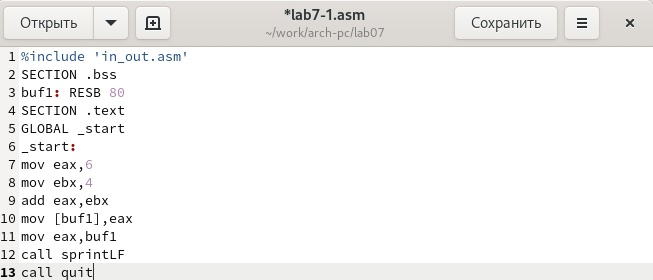{ #fig:004 width=70% }

Создали исполняемый файл и запустили его. (рис. [-@fig:005])

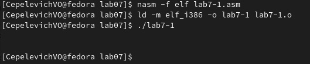{ #fig:005 width=70% }

Как и в предыдущем случае при исполнении программы мы не получим число 10. В данном случае выводится символ с кодом 10. Пользуясь таблицей ASCII
определили, что код 10 соответствует символ /n. Это символ перевода строки, он не отображается.

4. Как отмечалось выше,для работы с числами в файле in_out.asm реализованы подпрограммы для преобразования ASCII символов в числа и обратно.
Преобразовали текст программы из Листинга 7.1 с использованием этих функций.
Создали файл lab7-2.asm в каталоге ~/work/arch-pc/lab07 (рис. [-@fig:006]) и ввели в него текст программы из листинга 7.2. (рис. [-@fig:007])

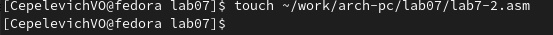{ #fig:006 width=70% }

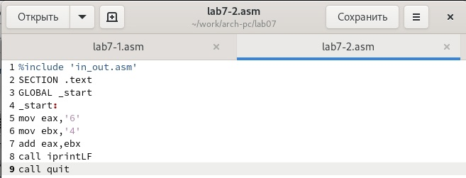{ #fig:007 width=70% }

Создали исполняемый файл и запустили его. (рис. [-@fig:008])

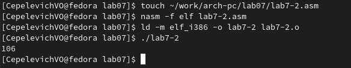{ #fig:008 width=70% }

В результате работы программы мы получили число 106. В данном случае, как
и в первом, команда add складывает коды символов ‘6’ и ‘4’ (54+52=106). Однако,
в отличии от программы из листинга 7.1, функция iprintLF позволяет вывести
число, а не символ, кодом которого является это число.

5. Аналогично предыдущему примеру изменим символы на числа. (рис. [-@fig:009])

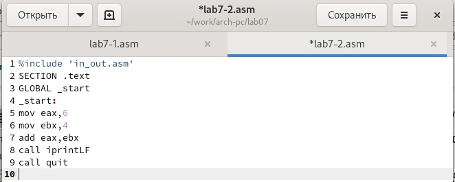{ #fig:009 width=70% }

Создайте исполняемый файл и запустите его. В результате при исполнении программы получили 10. (рис. [-@fig:010])

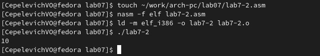{ #fig:010 width=70% }

Заменили функцию iprintLF на iprint. (рис. [-@fig:011]) Создайте исполняемый файл и запустите его. (рис. [-@fig:012]) Вывод функций iprintLF и iprint отличается наличием перевода строки после вывода?

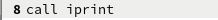{ #fig:011 width=70% }

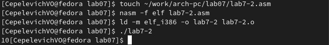{ #fig:012 width=70% }

## Выполнение арифметических операций в NASM

6. В качестве примера выполнения арифметических операций в NASM привели программу вычисления арифметического выражения f(x) = (5 ∗ 2 + 3)/3.
Создали файл lab7-3.asm в каталоге ~/work/arch-pc/lab07. (рис. [-@fig:013])

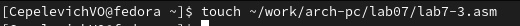{ #fig:013 width=70% }

Внимательно изучили текст программы из листинга 7.3 и ввели в lab7-3.asm. (рис. [-@fig:014])

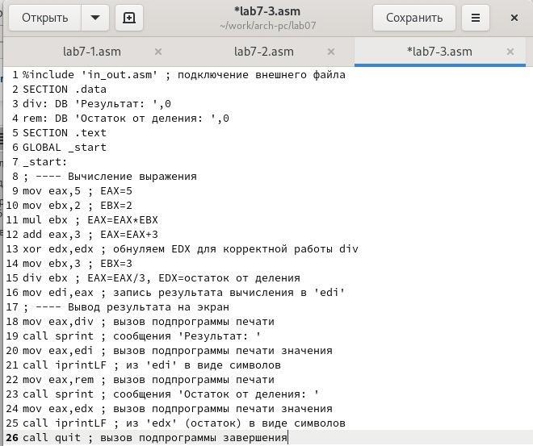{ #fig:014 width=70% }

Создали исполняемый файл и запустили его. Получили следующий результат. (рис. [-@fig:015])

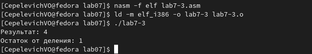{ #fig:015 width=70% }

Изменили текст программы для вычисления выражения f(x) = (4 ∗ 6 + 2)/5. (рис. [-@fig:016])

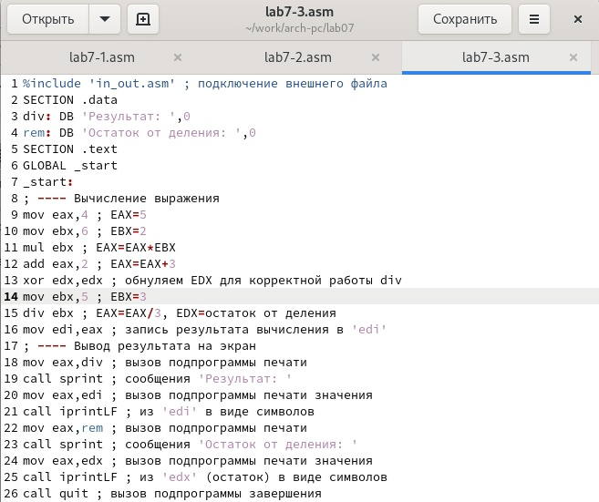{ #fig:016 width=70% }

Создали исполняемый файл и проверили его работу. (рис. [-@fig:017])

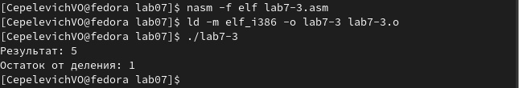{ #fig:017 width=70% }

7. В качестве другого примера рассмотрели программу вычисления варианта задания по номеру студенческого билета, работающую по следующему
алгоритму:

• вывести запрос на введение № студенческого билета
• вычислить номер варианта по формуле: (Sn mod 20) + 1, где Sn –
номер студенческого билета (В данном случае a mod b – это остаток
от деления a на b).
• вывести на экран номер варианта.

В данном случае число, над которым необходимо проводить арифметические
операции, вводится с клавиатуры. Как отмечалось выше, ввод с клавиатуры
осуществляется в символьном виде и для корректной работы арифметических
операций в NASM символы преобразуются в числа. Для этого использована функция atoi из файла in_out.asm.

Создали файл variant.asm в каталоге ~/work/arch-pc/lab07. (рис. [-@fig:018])

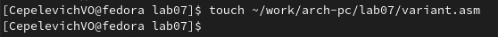{ #fig:018 width=70% }

Внимательно изучили текст программы из листинга 7.4 и ввели в файл variant.asm. (рис. [-@fig:019])

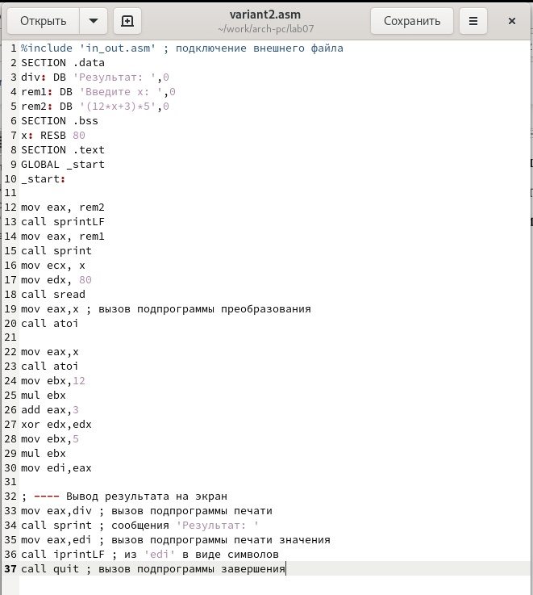{ #fig:019 width=70% }

Создали исполняемый файл и запустили его. (рис. [-@fig:020]) Проверили результат работы
программы вычислив номер варианта аналитически.

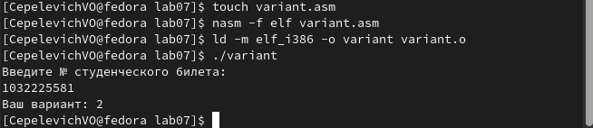{ #fig:020 width=70% }

Ответы на вопросы лабораторной работы:
1. Какие строки листинга 7.4 отвечают за вывод на экран сообщения ‘Ваш вариант:’?
	mov eax,rem
	call sprint
2. Для чего используется следующие инструкции? 
mov ecx, x - запись входной переменной в регистр ecx;
mov edx, 80 - запись размера перемнной в регистр edx;
call sread - вызов процедуры чтония данных;
3. Для чего используется инструкция “call atoi”?
Вызов atoi – функции преобразующей ascii-код символа в целое число и записывающий
результат в регистр eax.
4. Какие строки листинга 7.4 отвечают за вычисления варианта?
	xor edx,edx
	mov ebx,20
	div ebx
	inc edx
5. В какой регистр записывается остаток от деления при выполнении инструкции “div ebx”?
В регистр ebx.
6. Для чего используется инструкция “inc edx”?
Увеличивает значение edx на 1.
7. Какие строки листинга 7.4 отвечают за вывод на экран результата вычислений?
	mov eax,rem
	call sprint
	mov eax,edx
	call iprintLF

## Задание для самостоятельной работы

Написали программу вычисления выражения y = f(x). Программа
выводит выражение для вычисления, выводит запрос на ввод значения
x, вычисляет заданное выражение в зависимости от введенного x, выводит результат вычислений. (рис. [-@fig:021]) Вид функции f(x) выбрали из таблицы 7.3
вариантов заданий, наш номер - 20, полученный при выполнении лабораторной работы. Создали исполняемый файл и проверили его
работу для значений x1 = 1 и x2 = 3 из 7.3. (рис. [-@fig:022]).

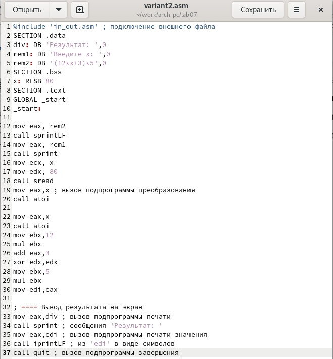{ #fig:021 width=70% }

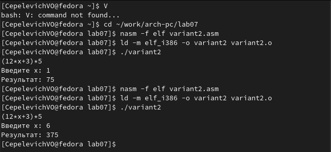{ #fig:022 width=70% }

# Выводы

В результате выполения лабораторной работы были освоены арифметические инструкции языка ассемблера NASM.

::: {#refs}
:::
