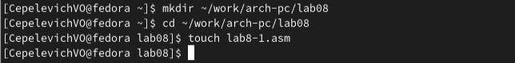

---
## Front matter
title: "Очёт по лабораторной работе № 8"
subtitle: "Архитектура Компьютера"
author: "Чепелевич Владислав Олегович"

## Generic otions
lang: ru-RU
toc-title: "Содержание"

## Bibliography
bibliography: bib/cite.bib
csl: pandoc/csl/gost-r-7-0-5-2008-numeric.csl

## Pdf output format
toc: true # Table of contents
toc-depth: 2
lof: true # List of figures
fontsize: 12pt
linestretch: 1.5
papersize: a4
documentclass: scrreprt
## I18n polyglossia
polyglossia-lang:
  name: russian
  options:
	- spelling=modern
	- babelshorthands=true
polyglossia-otherlangs:
  name: english
## I18n babel
babel-lang: russian
babel-otherlangs: english
## Fonts
mainfont: PT Serif
romanfont: PT Serif
sansfont: PT Sans
monofont: PT Mono
mainfontoptions: Ligatures=TeX
romanfontoptions: Ligatures=TeX
sansfontoptions: Ligatures=TeX,Scale=MatchLowercase
monofontoptions: Scale=MatchLowercase,Scale=0.9
## Biblatex
biblatex: true
biblio-style: "gost-numeric"
biblatexoptions:
  - parentracker=true
  - backend=biber
  - hyperref=auto
  - language=auto
  - autolang=other*
  - citestyle=gost-numeric
## Pandoc-crossref LaTeX customization
figureTitle: "Рис."
tableTitle: "Таблица"
listingTitle: "Листинг"
lofTitle: "Список иллюстраций"
lolTitle: "Листинги"
## Misc options
indent: true
header-includes:
  - \usepackage{indentfirst}
  - \usepackage{float} # keep figures where there are in the text
  - \floatplacement{figure}{H} # keep figures where there are in the text
---

# Цель работы

Изучить команды условного и безусловного переходов. Приобрести навыков написания программ с использованием переходов. Ознакомиться с назначением и структурой файла листинга.

# Задание

1. Реализовать переходы в NASM
2. Изучить структуру файлов листинга
3. Выполнить задание для самостоятельной работы

# Выполнение лабораторной работы

## Реализация переходов в NASM

1. Создали каталог для программам лабораторной работы № 8, перешли в
него и создали файл lab8-1.asm: (рис. [-@fig:001])

{ #fig:001 width=70% }

2. Инструкция jmp в NASM используется для реализации безусловных переходов. Рассмотрели пример программы с использованием инструкции jmp.
Ввели в файл lab8-1.asm текст программы из листинга 8.1. (рис. [-@fig:002])

{ #fig:002 width=70% }

Создали исполняемый файл и запустили его. Результат работы данной программы следующий: (рис. [-@fig:003])

{ #fig:003 width=70% }

Таким образом, использование инструкции jmp _label2 меняет порядок исполнения инструкций и позволяет выполнить инструкции начиная с метки
_label2, пропустив вывод первого сообщения.
Инструкция jmp позволяет осуществлять переходы не только вперед но
и назад. Изменили программу таким образом, чтобы она выводила сначала
‘Сообщение № 2’, потом ‘Сообщение № 1’ и завершала работу. Для этого в
текст программы после вывода сообщения № 2 добавили инструкцию jmp с
меткой _label1 (т.е. переход к инструкциям вывода сообщения № 1) и после
вывода сообщения № 1 добавили инструкцию jmp с меткой _end (т.е. переход к
инструкции call quit). Изменили текст программы в соответствии с листингом
8.2 (рис. [-@fig:004]), (рис. [-@fig:005])

{ #fig:004 width=70% }

{ #fig:005 width=70% }

Измените текст программы добавив или изменив инструкции jmp. (рис. [-@fig:006]), (рис. [-@fig:007])

{ #fig:006 width=70% }

{ #fig:007 width=70% }

Использование инструкции jmp приводит к переходу в любом случае. Однако, часто при написании программ необходимо использовать условные
переходы, т.е. переход должен происходить если выполнено какое-либо
условие. В качестве примера рассмотрели программу, которая определяет
и выводит на экран наибольшую из 3 целочисленных переменных: A,B
и C. Значения для A и C задаются в программе, значение B вводиться с
клавиатуры.
Создали файл lab8-2.asm в каталоге ~/work/arch-pc/lab08. (рис. [-@fig:008]) Внимательно
изучили текст программы из листинга 8.3 и введите в lab8-2.asm. (рис. [-@fig:009])

{ #fig:008 width=70% }

{ #fig:009 width=70% }

Создали исполняемый файл и проверили его работу для разных значений B. (рис. [-@fig:010])

{ #fig:010 width=70% }

Обратили внимание, в данном примере переменные A и С сравниваются как
символы, а переменная B и максимум из A и С как числа (для этого используется
функция atoi преобразования символа в число). Это сделано для демонстрации того, как сравниваются данные. Данную программу можно упростить и
сравнивать все 3 переменные как символы (т.е. не использовать функцию atoi).
Однако если переменные преобразовать из символов числа, над ними можно
корректно проводить арифметические операции.

## Изучение структуры файлы листинга

4. Обычно nasm создаёт в результате ассемблирования только объектный
файл. Получить файл листинга можно, указав ключ -l и задав имя файла
листинга в командной строке. Создали файл листинга для программы из
файла lab8-2.asm. (рис. [-@fig:011])

{ #fig:011 width=70% }

Открыли файл листинга lab8-2.lst с помощью текстового редактора mcedit:  (рис. [-@fig:012]), (рис. [-@fig:013])

{ #fig:012 width=70% }

{ #fig:013 width=70% }

Внимательно ознакомились с его форматом и содержимым. 
Содержимое трёх строк файла листинга:
1)45 00000154 B8[13000000] mov eax, msg2 - строка 45, адрес 00000154, B8[13000000] - машинный код, mov eax, msg2 - исходный текст программы
2)46 00000159 E8B1FEFFFF  call sprint - строка 46, адрес 00000159, E8B1FEFFFF - машинный код, call sprint - исходный текст программы
3)47 0000015E A1[00000000] mov eax,[max] - строка 47, адрес 0000015E, A1[00000000] - машинный код, mov eax,[max] - исходный текст программы

Открыли файл с программой lab8-2.asm и в инструкции mov с двумя
операндами удалить один операнд. (рис. [-@fig:014]) Выполните трансляцию с получением файла
листинга: (рис. [-@fig:015]), (рис. [-@fig:016])

{ #fig:014 width=70% }

{ #fig:015 width=70% }

{ #fig:016 width=70% }

Создаётся выходной файл lst. В листинге добавляется сообщение об ошибке.

## Задание для самостоятельной работы

1. Написали программу нахождения наименьшей из 3 целочисленных переменных a, b и c. (рис. [-@fig:017]) Значения переменных выбрали из таблицы в соответствии
с 2 вариантом, полученным при выполнении лабораторной работы № 7.
Создали исполняемый файл и проверили его работу. (рис. [-@fig:018])

{ #fig:017 width=70% }

{ #fig:018 width=70% }

2. Написали программу, которая для введенных с клавиатуры значений x
и a вычисляет значение заданной функции f(х) и выводит результат вычислений. (рис. [-@fig:019]) Вид функции f(x) выбрали из таблицы вариантов заданий в
соответствии с вариантом 2 , полученным при выполнении лабораторной
работы № 7. Создали исполняемый файл и проверили его работу для значений х и а. (рис. [-@fig:020])

{ #fig:019 width=70% }

{ #fig:020 width=70% }

# Выводы

В ходе выполнения лабораторной работы были изучены команды условного и безусловного переходов. Были приобретены навыки написания программ с использованием переходов. Ознакомились с назначением и структурой файла листинга.

::: {#refs}
:::
